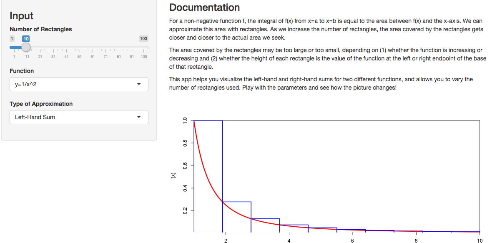

<!-- Limit image width and height -->
<style type='text/css'>
img {
    max-height: 560px;
    max-width: 964px;
}
</style>

<!-- Center image on slide -->
<script src="http://ajax.aspnetcdn.com/ajax/jQuery/jquery-1.7.min.js"></script>
<script type='text/javascript'>
$(function() {
    $("p:has(img)").addClass('centered');
});
</script>

## Definite Integral as Area

The definite integral of a non-negative function $f(x)$ from $x=a$ to $x=b$ is 
the area between the $x$-axis and the function.

```{r  "functiondef", echo=FALSE}

plotRect <- function (range, f, numrect, type=c('Left-Hand Sum', 'Right-Hand Sum')){
    lh = min(range)
    rh = max(range)
    delta = (rh-lh)/numrect
    newrange = seq(lh, rh, .001)
    plot(newrange, f(newrange), type='l', lwd=3, col='red', yaxs='i', xaxs='i',
         xlab='x', ylab='f(x)')
    
    if (numrect==0) {return(recordPlot())}
    
    for (i in 1:numrect){
        # Set x and y values
        left <- lh + (i-1) * delta
        right <- lh + i * delta
        x <- seq(left, left + delta, .001)
        if (type=='Left-Hand Sum') height=f(left)
        else if (type=='Right-Hand Sum') height=f(right)
        # Draw the tops of the rectangles
        points(x, rep(height, length=length(x)), type='l', col='blue', lwd=2)
        # Draw the vertical edges
        points(c(left, left), c(0, height),type='l', col='blue', lwd=2)
        points(c(right, right), c(0, height),type='l', col='blue', lwd=2)
    }
    recordPlot()
}
```

For example, the area indicated in the function below shows
$\int_{0}^{10}x^2dx$.

```{r echo=FALSE}
z <-  plotRect(1:10, function(x){x^2}, 0, 'Left-Hand Sum')
#replayPlot(z)
text(7,20, labels="This Area!", cex=3)
```


--- .class #id 

## Toys!

Since students understand things better when they can get their hands on the material
and play with it, we've made a simple app to help visualize approximating the "area under
the curve" with rectangles.



--- 

## Different Functions

Students can choose between an increasing and a decreasing function.

```{r echo=FALSE}
par(mfcol=c(1,2))
plotRect(1:10, function(x){x^2}, 10, 'Left-Hand Sum')
plotRect(1:10, function(x){1/x^2}, 10, 'Left-Hand Sum')

```

---

## Different Sums

Students can choose between left-hand and right-hand sums.

```{r echo=FALSE}
par(mfcol=c(1,2))
plotRect(1:10, function(x){x^2}, 10, 'Left-Hand Sum')
plotRect(1:10, function(x){x^2}, 10, 'Right-Hand Sum')

```

---

## Different Numbers of Rectangles

Students can see how, as the number of rectangles increases, 
the area covered by the rectangles gets closer to the desired area under the curve.

```{r echo=FALSE}
par(mfcol=c(1,3))
plotRect(1:10, function(x){x^2}, 10, 'Left-Hand Sum')
plotRect(1:10, function(x){x^2}, 20, 'Left-Hand Sum')
plotRect(1:10, function(x){x^2}, 100, 'Left-Hand Sum')

```
