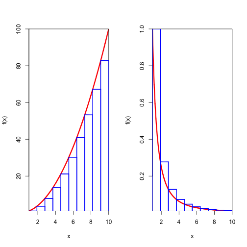

<!-- Limit image width and height -->

<!-- Center image on slide -->

## Definite Integral as Area

The definite integral of a non-negative function $f(x)$ from $x=a$ to $x=b$ is 
the area between the $x$-axis and the function.

For example, the area indicated in the function below shows
$\int_{0}^{10}x^2dx$.

 

--- .class #id 

## Toys!

Since students understand things better when they can get their hands on the material
and play with it, we've made a simple app to help visualize approximating the "area under
the curve" with rectangles.

--- 

## Different Functions

Students can choose between an increasing and a decreasing function.

 

---

## Different Sums

Students can choose between left-hand and right-hand sums.

 

---

## Different Numbers of Rectangles

Students can see how, as the number of rectangles increases, 
the area covered by the rectangles gets closer to the desired area under the curve.

 
